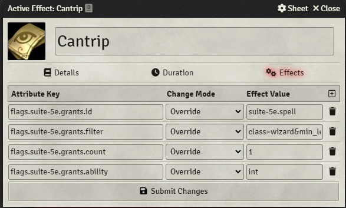

# Changelog

## Version 0.4.0
The 0.4.0 release of the module has a number of new features, improvements and bug fixes. This is a minor version increment, opposed to a patch increment, to accomodate a number of changes to the old implementation of certain features. The key feature delivered in this release is the Grants feature.

**⚠️ COMPATIBILITY WARNING ⚠️**  
Version 0.4.0 of Suite 5E now only supports the D&D 5E system from version 4.x.x. All previous supported has been dropped from the module, so please update your system to v4.x.x to use this and all future releases of the module.

**Installation:** To manually install this version, please use the following manifest URL:
https://github.com/TTimeGaming/FoundryVTT-Suite-5E/releases/download/v0.4.0/module.json

---

### Grants
  
This new feature allows users to provide their players with specific items via the Compendium Browser. Notably, this allows for players to select additional spells that they can learn, either from a filtered spell list or from the entire Compendium Browser. Alternatively, this can be used to explicitly link items together, allowing them to operate similarly to the Advancement Manager available to Race and Class items. Grants can be configured by any of the filters provided by the Compendium Browser to allow users to fine-tune what spells they want they players to be able to see.  

**⚠️ Known Issue:** Whilst this tool is fully implemented and configured to allow users to filter the spells displayed in the Compendium Browser, there is a known issue (available [here](https://github.com/foundryvtt/dnd5e/issues/4398)) that prevents the Compendium Browser from having filters pre-configured. Once this issue has been resolved, the filters will work as intended. This is an issue with the D&D 5E implementation of the Compendium Browser and cannot be rectified by this module alone.

---

### ⚠️ Breaking Changes
- Compatibility for the D&D 5E system v3.x.x has been removed, with support being delieverd for v4.x.x only

---

### Compendium Content
- Several new example items to demonstrate the tools provided by Suite 5E's expanded Active Effect flags

---

### Bug Fixes
- None

---

### Improvements
- Added additional support for further dialog prompts:
    - Initiative rolls are now supported but will not function properly until the issue raised [here](https://github.com/foundryvtt/dnd5e/issues/4399) is resolved
    - Death saving rolls now support dialog prompts
- `Custom Dialogs` have been refactored to be known as `Custom Choices` across the repository to better reflect their functionality

---

## Version 0.3.4
- Fixed bug whereby the Examples Compendium was empty
- Updated D&D verified version to 4.0.2

## Version 0.3.3
- Fixed bug with weapon proficiency dialog storing incorrectly as armor proficiency

## Version 0.3.2
- Renamed references from Roll Prompts to Dialog Prompts to better identify feature behavior
- Added support for roll data to be parsed directly via prompts
- Expanded support for additional Dialog Prompts:
    - Damage rolls
    - Rest dialogs
- Added support for wider range of attack options for specific scenarios
- Planned to drop support for D&D v3.x.x with release of official 4.x.x verisoning from Version 0.4.0

## Version 0.3.1
- New Grants feature added to Custom Dialogs
    - Added new `flags.suite-5e.dialog.grants` key to allow for dialogs to give actors additional items based on the outcome of the dialog
    - Multiple items can be given for one choice by using the same `[choiceID]`, as explained further in the Wiki

## Version 0.3.0
**Breaking Changes: Version 0.3.0 is no longer compatible with previous versions. Apologies.**
- Updated support for Roll Prompts to display prompts from multiple sources at the same time
    - **This is a breaking change, as it relies on a hook called when an Actor is created, and all Roll Prompt change modes should be updated from `Override` to `Add`**  
    ***Update at your own discretion***
- Roll dialog windows now size appropriately to fit all prompts correctly
- Roll Prompts indicate their source in the description (e.g. `This is an <b>example</b> prompt <i>(Your Feature)</i>`)

## Version 0.2.4
- Updated Roll Prompts to display both global and local prompts (e.g. when both `flags.suite-5e.prompts.check.all` and `flags.suite-5e.prompts.check.str` are set)

## Version 0.2.3
- Updated module.json to include `manifest` and `download` keys

## Version 0.2.2
- Amended all `suite-5e.custom-dialog` references to `suite-5e.dialog` for clarity and efficiency

## Version 0.2.1
- Added automatic hooks for Custom Dialogs using the `flags.suite-5e.dialog.id` field:
    - `suite-5e.armor` Used to automatically add and remove custom armor proficienxies
    - `suite-5e.weapon` Used to automatically add and remove custom weapon proficienxies
    - `suite-5e.tool` Used to automatically add and remove custom tool proficienxies
    - `suite-5e.language` Used to automatically add and remove custom known languages
    - `suite-5e.save` Used to automatically add and remove custom saving throw proficienxies
    - `suite-5e.skill` Used to automatically add and remove custom skill proficienxies
- `suite-5e.custom-dialog.add` and `suite-5e.custom-dialog.rem` hook events now receive the relevant actor as an argument
- Fixed missing languages in the `suite-5e.dialog.languages` keys

## Version 0.2.0
- Added support for Custom Dialogs to be configured via Active Effect keys
    - Dialogs can be configured with the following keys:
        - `flags.suite-5e.dialog.id` (required)  
        Passed to the `suite-5e.custom-dialog.add` and `suite-5e.custom-dialog.rem` hook events for proper identification of dialogs
        - `flags.suite-5e.dialog.options` (required)  
        A comma-separated list of options to select from in the dialog window
        - `flags.suite-5e.dialog.title` (optional)  
        Displayed in the title bar of the opened dialog window (defaults to "Custom Dialog")
        - `flags.suite-5e.dialog.message` (optional)  
        Displayed above the option picker in the dialog window (defaults to an empty string)
        - `flags.suite-5e.dialog.count` (optional)  
        The number of options that can be selected (defaults to 1)
    - Hook events are fired when options are added, removed or changed via the `suite-5e.custom-dialog.add` and `suite-5e.custom-dialog.rem` hook events

## Version 0.1.1
- Added backwards compatibility for D&D v3.x.x
    - Verified version remains as D&D v4.0.0 as development conducted against this pre-release

## Version 0.1.0
- Added support for custom Roll Prompts for the following roll dialogs:
    - Ability Checks
    - Saving Throws
    - Concentration Checks
    - Skill Checks
    - Attack Rolls
- Outlined required hooks for Custom Dialogs to be implemented in a future update
