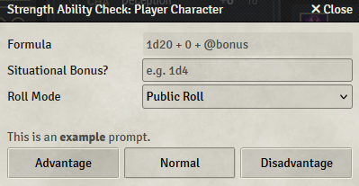

# FoundryVTT Module: Suite 5E

This is a FoundryVTT module providing an expanded suite of tools to further utilise the official [D&D 5E system](https://foundryvtt.com/packages/dnd5e).

*This module is in active development and features will be expanded on frequently. Please submit any feature requests via the [Issues](https://github.com/TTimeGaming/FoundryVTT-Suite-5E/issues) page.*

## Major Features

### Roll Prompts
These prompts allow users to specify prompts in the roll dialog windows using Active Effect keys for given hooks, such as ability checks, saving throws, skill checks, and more. These can be used to remind players of conditions that may change the roll mode (e.g. advantage on saving throws against poison), damage dice (e.g. + 1d8 if the target is undead) that cannot be automated using the tools provided by the D&D system.

### Custom Dialogs
These dialogs can be configured using Active Effect keys to display when an item is added to an actor's sheet and can be used in a variety of ways, but functionality will primarily need to be implemented via a module listening to the `suite-5e` hooks. Implementations are incredibly versatile, but can allow for items to provide an actor with an additional language, skill choice, proficiency with an armor or weapon, etc. The chosen option can also be amended using the "Amend Option" context menu item.

### Fully-Fledged Wiki
This module has a fully-fledged [Wiki](https://github.com/TTimeGaming/FoundryVTT-Suite-5E/wiki) providing a full list of all available features and associated Active Effect keys, where necessary, to utilise the suite to its full potential. If you believe anything is missing from the wiki, please raise it on the [Issues](https://github.com/TTimeGaming/FoundryVTT-Suite-5E/issues) page so it can be resolved as quickly as possible.

### Planned Features
- Roll Prompts to identify the source of the prompt (e.g. `This is an <b>example</b> prompt. (<i>Example Feature</i>)`)
- Roll Prompt values to be converted from Strings to Sets to allow multiple prompts per roll  
***(This will be a breaking change as Active Effect Change Modes will need to be amended from `Override` to `Add`)***
- Grants to be implemented, and fully compatible with Custom Dialogs, to allow player's to choose items (similar to the D&D 5E Choose Items advancement).

## Known Issues
- **Unable to append a prompt to initiative rolls** (v0.1.0)  
This issue is caused by the `dnd5e.preRollInitiative` hookEvent being fired **after** the roll dialog has been closed instead of before, as with all other rolls.
- **Unable to remove tool proficiencies applied by Custom Dialog** (v0.2.1)   
This issue has recently been highlighted and is being looked into.

---
This module has been built using HTML5, CSS3 and Javascript.

